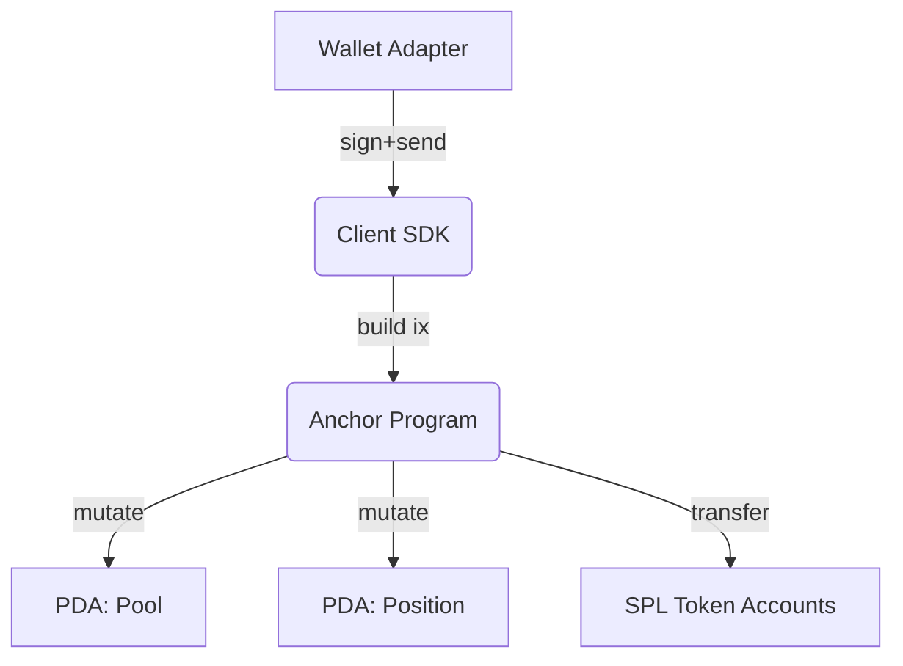

import { Callout } from '@/components/callout'

## Overview

The Staking Lab is a Solana-based staking system for the LABS token. It comprises:

- On-chain program (Anchor) for secure staking logic.
- Client SDK and React UI to interact with the program.
- PDAs for deterministic and permissioned state.

### Goals

- Secure and auditable token staking and reward accrual.
- Efficient transactions and low fees.
- Clear separation between protocol logic (program) and presentation (client/UI).

## Architecture

- **Program**: Anchor-based Rust program that manages staking pools, stake positions, rewards, and admin configuration.
- **PDAs**: Derive program-owned accounts for pool and user positions.
- **Client**: TypeScript utilities wrapping `@coral-xyz/anchor` and `@solana/web3.js` for instruction building.
- **UI**: Next.js app integrating wallet adapters and the client SDK.



## Accounts and PDAs

- **Pool PDA**: Global staking pool config and reward parameters.
  - Seeds: `['pool', mint]`
  - Holds: authority, staking mint, reward config, bump
- **Position PDA**: One per staker per pool.
  - Seeds: `['position', pool, staker]`
  - Holds: staker pubkey, deposited amount, last accrual timestamp, bump

## Instruction Set

- `initialize_pool` — Create and configure a staking pool.
- `stake` — Deposit LABS into a position.
- `accrue` — Update rewards based on time elapsed.
- `claim` — Withdraw accrued rewards to user.
- `unstake` — Withdraw principal (optionally after cooldown/lock).
- `set_config` — Admin updates to pool parameters.

## On-chain Program (Anchor/Rust)

```rust
use anchor_lang::prelude::*;
use anchor_spl::token::{self, Token, TokenAccount, Mint, Transfer};

declare_id!("Stake111111111111111111111111111111111111111");

#[program]
pub mod staking_lab {
    use super::*;

    pub fn initialize_pool(
        ctx: Context<InitializePool>,
        reward_rate_per_second: u64,
    ) -> Result<()> {
        let pool = &mut ctx.accounts.pool;
        pool.authority = ctx.accounts.authority.key();
        pool.stake_mint = ctx.accounts.stake_mint.key();
        pool.reward_rate_per_second = reward_rate_per_second;
        Ok(())
    }

    pub fn stake(ctx: Context<Stake>, amount: u64) -> Result<()> {
        let position = &mut ctx.accounts.position;
        // Accrue before state change
        position.accrue(&ctx.accounts.pool)?;

        // Transfer tokens from user to vault
        let cpi_ctx = CpiContext::new(
            ctx.accounts.token_program.to_account_info(),
            Transfer {
                from: ctx.accounts.user_stake_ata.to_account_info(),
                to: ctx.accounts.vault_stake_ata.to_account_info(),
                authority: ctx.accounts.staker.to_account_info(),
            },
        );
        token::transfer(cpi_ctx, amount)?;

        position.amount = position.amount.checked_add(amount).ok_or(ErrorCode::MathOverflow)?;
        Ok(())
    }

    pub fn claim(ctx: Context<Claim>) -> Result<()> {
        let position = &mut ctx.accounts.position;
        position.accrue(&ctx.accounts.pool)?;
        let rewards = position.rewards_owed;
        require!(rewards > 0, ErrorCode::NothingToClaim);
        position.rewards_owed = 0;
        // Transfer rewards from reward vault to user reward ATA ...
        Ok(())
    }
}

#[account]
pub struct Pool {
    pub authority: Pubkey,
    pub stake_mint: Pubkey,
    pub reward_rate_per_second: u64,
    pub bump: u8,
}

#[account]
pub struct Position {
    pub staker: Pubkey,
    pub pool: Pubkey,
    pub amount: u64,
    pub rewards_owed: u64,
    pub last_accrual_ts: i64,
    pub bump: u8,
}

impl Position {
    pub fn accrue(&mut self, pool: &Account<Pool>) -> Result<()> {
        let now = Clock::get()?.unix_timestamp;
        if self.amount == 0 { return Ok(()); }
        let dt = now.saturating_sub(self.last_accrual_ts) as u64;
        let added = dt
            .checked_mul(pool.reward_rate_per_second)
            .and_then(|r| r.checked_mul(self.amount))
            .ok_or(ErrorCode::MathOverflow)?;
        self.rewards_owed = self.rewards_owed.checked_add(added).ok_or(ErrorCode::MathOverflow)?;
        self.last_accrual_ts = now;
        Ok(())
    }
}

#[error_code]
pub enum ErrorCode {
    #[msg("Math overflow")] MathOverflow,
    #[msg("Nothing to claim")] NothingToClaim,
}
```

> Note: The above illustrates structure and invariants; consult the actual program in `anchor/` for the authoritative implementation, seeds, and constraints.

## Client SDK (TypeScript)

```typescript
import { Program, BN, AnchorProvider, Idl } from '@coral-xyz/anchor'
import { Connection, PublicKey, SystemProgram } from '@solana/web3.js'

export async function getPoolPda(mint: PublicKey, programId: PublicKey) {
  const [pool] = PublicKey.findProgramAddressSync(
    [Buffer.from('pool'), mint.toBuffer()],
    programId
  )
  return pool
}

export async function stake(
  program: Program<Idl>,
  { pool, position, staker, userStakeAta, vaultStakeAta }: {
    pool: PublicKey
    position: PublicKey
    staker: PublicKey
    userStakeAta: PublicKey
    vaultStakeAta: PublicKey
  },
  amount: BN
) {
  return program.methods
    .stake(amount)
    .accounts({ pool, position, staker, userStakeAta, vaultStakeAta, systemProgram: SystemProgram.programId })
    .rpc()
}
```

## Typical Flow

1. User connects wallet.
2. SDK derives PDAs for pool and position.
3. User stakes LABS → tokens transferred to program vault ATA.
4. Rewards accrue over time → `accrue` or lazy accrual on `claim`/`unstake`.
5. User claims rewards and/or unstakes principal.

## Security Considerations

- Validate signer and authority on mutating instructions.
- Check PDA seeds and `owner` for all program-owned accounts.
- Prevent overflow with checked math; prefer `require!` for invariants.
- Keep reward vaults owned by PDAs to restrict access.
- Use freeze authorities if applicable and audited token mints.

## Performance Notes

- Bundle accrual with stake/claim to reduce extra transactions.
- Avoid unnecessary sysvars or large account data; keep account layouts small.
- Cache PDAs and fetched accounts on the client when possible.

## Local Development

```bash
pnpm dev
# For Anchor local testing
pnpm anchor-localnet
pnpm anchor-build
pnpm anchor-test
```

## Deployment Checklist

- Anchor `program-id` set and deployed per environment.
- Vault ATAs created and initialized.
- Admin authority secured and documented.
- Frontend env vars configured (RPC, program IDs, mint addresses).
- End-to-end smoke tests on devnet before mainnet deployment.

## Troubleshooting

- "Invalid account owner" → check ATA owners and PDA derivations.
- "Constraint seeds" or "Constraint has_one" → verify seeds and account relationships.
- Zero rewards on claim → ensure `accrue` path executed and `reward_rate_per_second` > 0.

## Glossary

- **PDA**: Program Derived Address, deterministic program-owned account.
- **ATA**: Associated Token Account for SPL tokens.
- **Accrual**: Computation of rewards owed since last timestamp.

<Callout>
Always verify PDAs, signers, and mint addresses per environment to avoid lost funds.
</Callout>


